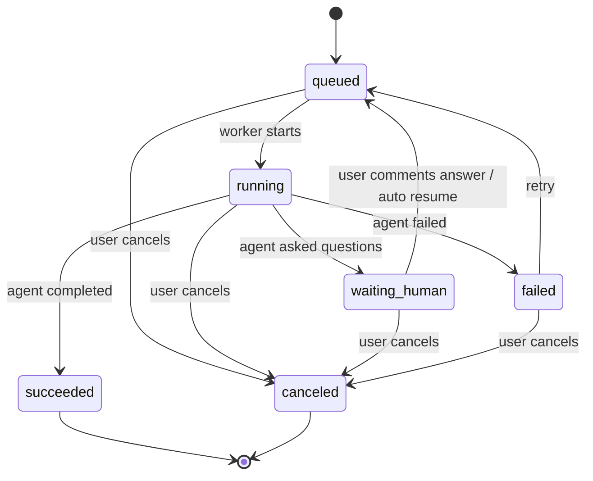
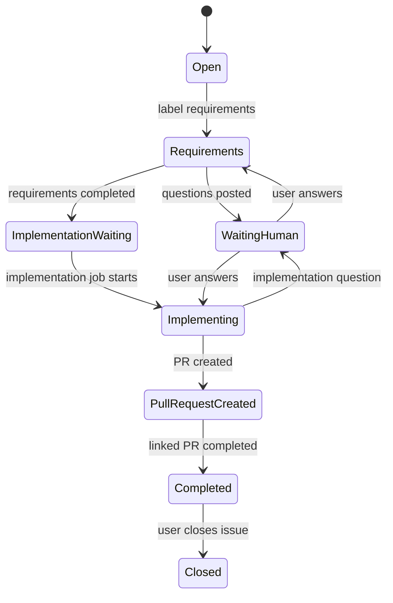
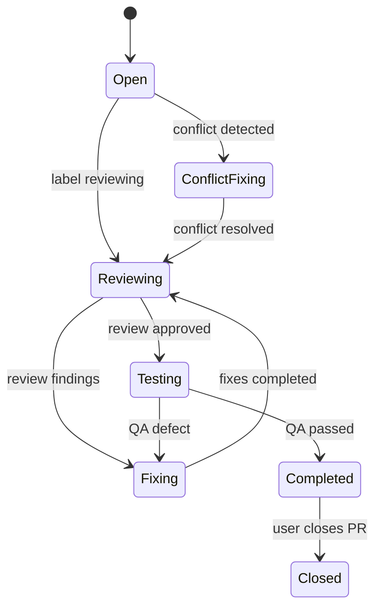
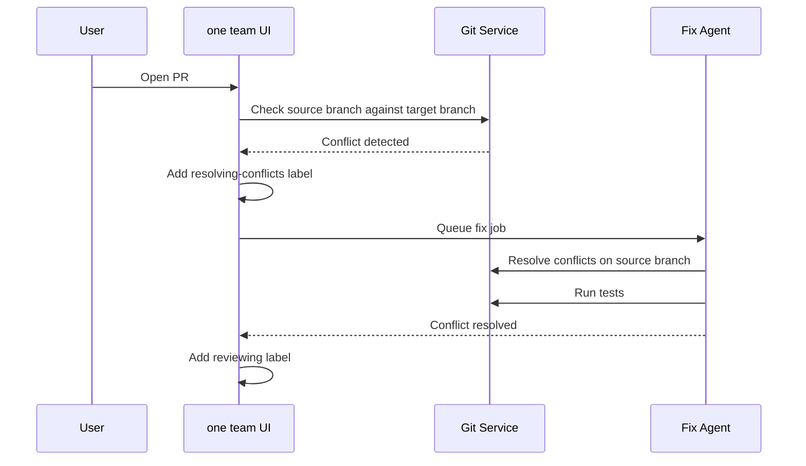

# Agent Job state machine

## 1. 目的

Agent Job、issue label、pull request label の状態遷移を定義する。実装ではこの資料を基準に job queue、auto resume、label automation、UI status 表示を作る。

## 2. Agent Job Status

| Status | 意味 |
| --- | --- |
| `queued` | 実行待ち |
| `running` | 実行中 |
| `waiting_human` | 人間の入力待ち |
| `succeeded` | 正常終了 |
| `failed` | 失敗 |
| `canceled` | キャンセル済み |

## 3. Agent Job State Machine

## 4. Job Creation Events

| Event | 作成される Job | Target |
| --- | --- | --- |
| issue に `requirements` label が付与 | `requirements` | issue |
| `waiting_human` issue に user comment | previous agent または next job | issue |
| issue に `ready-for-implementation` label が付与 | `implementation` | issue |
| PR に `reviewing` label が付与 | `review` | pull request |
| PR に `fixing` label が付与 | `fix` | pull request |
| PR に `resolving-conflicts` label が付与 | `fix` | pull request |
| PR に `testing` label が付与 | `qa` | pull request |
| repository import 完了 | `command_detection` | project |
| merge conflict 検出 | `fix` | pull request |

Label automation is edge-triggered: a job is queued when a trigger label is newly
applied. If an active job of the same agent type already exists for the same
target, no duplicate job is created. Agent `metadata.nextLabel` transitions use
the same automation rules as user/API label updates.

## 5. Issue Workflow

## 6. Issue Label Rules

| Current | Event | Next |
| --- | --- | --- |
| none | user starts requirements | `requirements` |
| `requirements` | agent asks question | `needs-input` |
| `needs-input` | user answers | `requirements` |
| `requirements` | requirements complete | `ready-for-implementation` |
| `ready-for-implementation` | implementation starts | `implementing` |
| `implementing` | implementation asks question | `needs-input` |
| `needs-input` | user answers implementation question | `implementing` |
| `implementing` | PR created | `pull-request-created` |
| `pull-request-created` | PR completed | `done` |

## 7. Pull Request Workflow

## 8. Pull Request Label Rules

| Current | Event | Next |
| --- | --- | --- |
| none | PR created | `reviewing` |
| `reviewing` | review findings | `fixing` |
| `fixing` | fix complete | `reviewing` |
| `reviewing` | review approved | `testing` |
| `testing` | QA defect | `fixing` |
| `testing` | QA passed | `done` |
| any open PR | merge conflict detected | `resolving-conflicts` |
| `resolving-conflicts` | conflict resolved | `reviewing` |

## 9. Human Gate

Human Gate は Agent が自力で決めるべきではない判断をユーザーに戻す状態。

### 9.1 Enter

1. Agent が質問コメントを投稿する。
2. Job status を `waiting_human` にする。
3. 対象 issue / PR に `needs-input` label を付与する。

### 9.2 Exit

1. ユーザーが comment を投稿する。
2. system が未解決の `waiting_human` job を探す。
3. `needs-input` label を外し、元の作業 label を戻す。
4. 同じ job を `queued` に戻し、`attempt` を increment する。
5. Activity に human answer received を記録する。

## 10. Activity State Rules

| Job Status | Activity |
| --- | --- |
| `queued` | `system`: job queued |
| `running` | `progress`: job started |
| `running` | `thinking`: safe reasoning summary |
| `running` | `command`: command executed |
| `running` | `file_change`: files changed |
| `running` | `test`: test/build/lint result |
| `waiting_human` | `progress`: waiting for user answer |
| `failed` | `error`: failure summary |
| `succeeded` | `progress`: job completed |
| `canceled` | `system`: job canceled |

## 11. Locking

同じ対象に対して複数の write job を同時実行しない。

| Target | Lock Key |
| --- | --- |
| issue implementation | `project:{projectId}:issue:{issueId}:write` |
| pull request fix | `project:{projectId}:pull_request:{pullRequestId}:write` |
| repository command detection | `project:{projectId}:repository:commands` |

Worker は `running` job の `lockKey` を見て、同じ `lockKey` を持つ
`queued` job を実行対象から一時的に除外する。該当 job は running lock が
解放された後に実行される。

Read-only review は原則 lock 不要。ただし review 結果で label を変更するため、label update 時は短い transaction lock を使う。

## 12. Retry

Retry は新しい attempt として扱う。

- `agent_jobs.attempt` を increment する。
- previous job の `parent_job_id` を参照する新 job を作成してもよい。
- Activity Log には retry 開始を `system` として記録する。

## 13. Cancel

Cancel は job status を `canceled` にする。

実行中 process がある場合:

- Codex CLI process を停止する。
- Activity Log に canceled を記録する。
- 部分的な file change が残る可能性があるため、Repository 画面に dirty state を表示する。

自動 rollback は MVP では行わない。

## 14. Merge Conflict Flow

