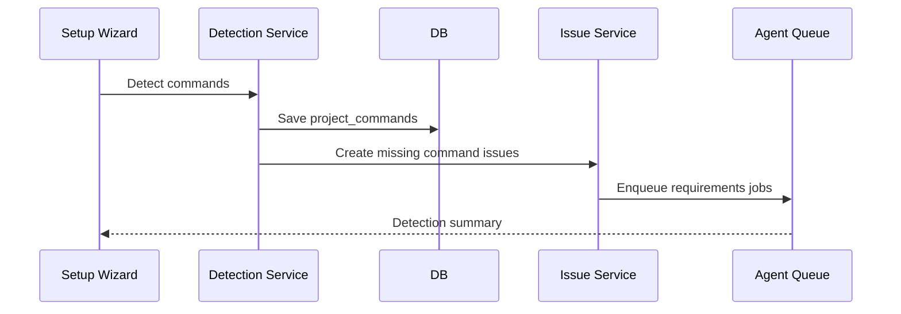

# command auto-detection 仕様

## 1. 目的

repository import 時に install / dev / build / test / lint command を自動検出し、足りない command があれば one team が issue を作成して実装を開始できる状態にする。

## 2. 対象 Command

| Command Type | 必須 | 用途 |
| --- | --- | --- |
| `install` | yes | dependencies install |
| `dev` | yes | local development server |
| `build` | yes | production build |
| `test` | yes | automated tests |
| `lint` | yes | static checks |

MVP ではすべて required とする。対象 repository に該当概念がない場合も、AI が要件定義で代替方針を明記する。

## 3. Detection Input

- repository root path
- file list
- `package.json`
- lock files
- workspace files
- build tool config
- test tool config
- lint tool config

## 4. Package Manager Detection

優先順位:

1. `packageManager` field in `package.json`
2. lock file
3. known workspace file
4. fallback to `npm`

| Signal | Package Manager |
| --- | --- |
| `packageManager: "pnpm@..."` | pnpm |
| `packageManager: "yarn@..."` | yarn |
| `packageManager: "bun@..."` | bun |
| `pnpm-lock.yaml` | pnpm |
| `yarn.lock` | yarn |
| `bun.lockb` / `bun.lock` | bun |
| `package-lock.json` | npm |

## 5. Script Detection

`package.json.scripts` を確認する。

| Command Type | Preferred Script Names |
| --- | --- |
| `dev` | `dev`, `start` |
| `build` | `build` |
| `test` | `test`, `test:unit` |
| `lint` | `lint`, `check` |

検出 command は package manager に応じて生成する。

| Package Manager | Script Command |
| --- | --- |
| npm | `npm run {script}` |
| pnpm | `pnpm {script}` |
| yarn | `yarn {script}` |
| bun | `bun run {script}` |

`install`:

| Package Manager | Install Command |
| --- | --- |
| npm | `npm install` |
| pnpm | `pnpm install` |
| yarn | `yarn install` |
| bun | `bun install` |

## 6. Config Detection

script がない場合、config file から「実装すべき候補」を推定する。

### 6.1 Build

| Signal | Recommended Command |
| --- | --- |
| `vite.config.*` | `{pm} run build` with `vite build` script |
| `next.config.*` | `{pm} run build` with `next build` script |
| `tsconfig.json` | `{pm} run build` with `tsc -p tsconfig.json` script |

### 6.2 Test

| Signal | Recommended Command |
| --- | --- |
| `vitest.config.*` | `{pm} run test` with `vitest run` |
| `jest.config.*` | `{pm} run test` with `jest` |
| `playwright.config.*` | e2e candidate, not unit replacement |

### 6.3 Lint

| Signal | Recommended Command |
| --- | --- |
| `eslint.config.*` / `.eslintrc.*` | `{pm} run lint` with `eslint .` |
| `biome.json` | `{pm} run lint` with `biome check .` |

## 7. Detection Result

```json
{
  "packageManager": "pnpm",
  "commands": {
    "install": {
      "command": "pnpm install",
      "isAvailable": true,
      "source": "pnpm-lock.yaml",
      "confidence": "high"
    },
    "build": {
      "command": null,
      "isAvailable": false,
      "source": "missing",
      "confidence": "high",
      "recommendation": "Add build script using vite build."
    }
  },
  "missingCommands": ["build"]
}
```

## 8. Persistence

検出結果は `project_commands` に保存する。

- `command_type`: command type
- `command`: 実行可能な command。missing の場合 null
- `detection_source`: `package_json` / `lock_file` / `config` / `missing`
- `detection_details_json`: signal files、confidence、recommendation
- `is_required`: MVP では true
- `is_available`: 実行可能な command があるか

## 9. Missing Command Issue

不足 command がある場合、command ごとに issue を作成する。複数不足している場合は、MVP では command ごとに分ける。

### 9.1 Issue Title

```text
Add {commandType} command
```

例:

```text
Add build command
```

### 9.2 Issue Body Template

```markdown
## Background

one team detected that this repository does not have a `{commandType}` command.

## Detection Result

- Package manager: `{packageManager}`
- Detected files: `{signals}`
- Current command: missing

## Requirement

Add a working `{commandType}` command so one team can run automated development,
review, and QA workflows.

## Suggested Implementation

{recommendation}

## Acceptance Criteria

- `{commandType}` command is defined in project commands.
- The command can be executed from the repository root.
- The command result is visible in one team Activity Log.
```

### 9.3 Labels

自動作成 issue には次を付与する。

- `requirements`

要件が十分明確な場合でも、Requirements Agent を通してから Implementation Agent に渡す。

## 10. Auto Start Flow



## 11. Monorepo Handling

MVP では one team が管理する repository root を command 実行 root とする。

Monorepo を検出した場合:

- root `package.json` に command があればそれを採用する。
- root に command がなければ missing とする。
- workspace package 個別 command の自動推定は future work。

## 12. Non-Node Repository

MVP では Node.js repository を主対象とする。Node.js 以外の repository を検出した場合:

- package manager は `unknown`。
- commands は missing とする。
- one team は必要 command 実装 issue を作成する。
- Requirements Agent が repository の技術に合わせた command 要件を定義する。

## 13. Re-detection

ユーザーが Repository 画面で `Detect again` を押すと再検出する。

Rules:

- manual override の command は上書きしない。
- `agent` source の command は、実ファイルと一致する場合維持する。
- missing が解消されたら関連 issue にコメントを追加する。
- 新たな missing があれば issue を作成する。

## 14. Acceptance Criteria

- lock file から package manager を判定できる。
- `package.json.scripts` から command を作れる。
- missing command ごとに issue を作成できる。
- 検出結果が Repository 画面に表示される。
- 再検出で project_commands が更新される。
