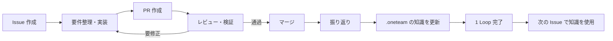

# OneTeam: Loop Engineering 特化への再構築計画

作成日: 2026-09-11 / 実装状況更新: 2026-09-12

依頼と、未コミット変更を含む作業ツリーを確認して作成した実装計画。以下の現状比較と調査結果は着手前の記録であり、実装後の到達点は末尾の「実装結果」に記載する。過去の Loop Engineering 計画を継ぎ足すのではなく、以下の要件から実行単位を再定義した。

## 1. 結論

**Issue・PR・Agent ログ・Git 操作を流用し、Loop の進行管理、振り返り、知識更新、モデル選択を新しく作る。** Electron / React / Hono / libSQL / Drizzle / TypeScript は維持する。

全面的な作り直しでは、差分表示、コメント、worktree、マージ競合処理、再起動時の復旧まで再実装することになる。一方、既存の進行管理は `objective_runs`、`loop_runs`、`loop_steps`、ラベル、Agent Job にまたがっている。この部分に振り返りを追加するより、進行管理を一本化して既存部品を接続する方が見通しがよい。

完成形は次の流れとする。



## 2. 要件と今回の設計上の前提

| 要件 | 計画する動作 |
| --- | --- |
| GitHub ライクな Issue / PR | 一覧、詳細、コメント、差分、レビュー、マージの体験を維持する |
| Agent タブ | 工程、進捗、コマンド、変更、検証結果、停止理由に加え、モデルと選択理由を表示する |
| Codex 固定 | 他 provider の実行経路と設定を削除する。Codex 内でモデルを自動選択する |
| プロジェクト選択不要 | フォルダを開く操作に統一し、プロジェクトの登録・選択・命名をなくす |
| `.oneteam` がなければ初期化のみ | DB、内部メタデータ、最小限の知識ファイルを作成する。Welcome Issue や Agent Job は作らない |
| `.oneteam` があれば既存状態を利用 | 再初期化せず、形式確認と必要なバージョン移行だけ行う |
| マージ後の振り返り | 専用の Codex Job で Loop 全体を分析し、再利用できる知識を作成・修正・整理する |
| 次のタスクへの反映 | 保存した知識を次の Job の入力へ明示的に読み込み、使用した版も記録する |
| 設定を極力なくす | モデル、役割分担、Loop 定義、リスク閾値、反復回数等をユーザーに設定させない |

設計上の前提は以下とする。未確定事項を設定画面に押し込まない。

- Issue / PR は現状どおりローカル管理。GitHub への同期・push は今回追加しない。
- 現状の自動実行・自動マージを引き継ぎ、Issue 作成後はレビューと検証を通過すれば自動で進める。停止・再開・キャンセルと、必要な質問への回答は残す。
- 初版は1フォルダ内の Loop を直列実行する。振り返りの反映後に次の Issue を開始し、知識の競合と反映前の実行を避ける。
- 実行対象は Git リポジトリを基本とする。Git 未初期化・初回コミット前・リポジトリ内のサブフォルダは開く時点で判定する。通常フォルダの自動 Git 化は今回の必須要件に含めず、既存ファイルの自動コミットは行わない。対応が必要な状態は具体的に表示する。
- マージ先は初期化時に Git の既定ブランチ情報から解決して保存する。判定不能時は現在のブランチを用いる。Job ごとにその時点の checkout 先へ追従させない。

## 3. 現在の実装と差分

| 領域 | 確認できた実装 | 必要な変更 |
| --- | --- | --- |
| 起動 | フォルダ選択・ドロップ、フォルダ配下の DB、前回フォルダ復元がある | フォルダの状態を唯一の入口にする。登録済みプロジェクト一覧や registry を整理する |
| 初期化 | Project 作成、知識テンプレート、Welcome Issue、待機 Job を作る | Welcome Issue / Job を廃止し、初期化の完了と Issue 作成を分離する |
| 開発フロー | requirements → implementation → review / fix → QA → verifier → merge | 一本の Loop に工程を所属させ、ラベルを状態遷移の起点から外す |
| Loop | ラベルによる工程ごとに Loop Run を作り、上位 Objective で束ねる | Issue から知識反映までを単一の実行単位として保持する |
| Memory | 工程の `result.message`、マージ情報等を DB と Markdown に追記する | 全工程を根拠にした振り返り、既存知識の修正・統合・削除を追加する |
| 知識の再利用 | `skills/` と `memory/` の Markdown 全文を毎 Job の prompt に渡す | 短い共通知識＋必要な詳細知識を選択し、長大な過去ログの投入を避ける |
| モデル | provider / role の設定を Job 作成時に参照する | タスクの難度・影響範囲・失敗内容から実行時に選択する |
| モデルのログ | `aiModel`、provider 選択 Activity、実行 metadata、詳細表示がある | 未指定時は null。選択理由、確定モデル、再試行ごとの履歴が必要 |
| 設定 | UI の旧フォームは `hidden` 内に残り、設定 API と他 provider も残る | 非表示に留めず不要なコード、DTO、API、設定保存を削除する |
| 信頼性 | worktree、検証、競合検知、利用枠待機、再起動復旧、マージ後処理の再試行がある | 部品とテストを移植し、新しい Loop 状態へ接続する |

主な根拠:

- [初期化 API](../src/server/app.ts)、[Welcome Issue 作成](../src/server/services/project-onboarding.ts)、[起動画面](../src/client/components/SetupWizard.tsx)
- [runtime と DB 切替](../src/server/runtime.ts)、[フォルダ registry / 設定](../src/server/config.ts)
- [ラベル駆動](../src/server/services/label-automation.ts)、[Loop Run 作成](../src/server/services/loop-runner.ts)、[Objective 状態遷移](../src/server/services/objective-workflow.ts)
- [Worker](../src/server/agents/worker.ts) の `updateLoopForResult`、[Objective](../src/server/services/objective-runs.ts) の `markObjectiveMerged`
- [知識ファイル](../src/server/services/knowledge-files.ts)、[入力構築](../src/server/agents/context.ts)、[prompt](../src/server/agents/prompts.ts)
- [モデル設定の解決](../src/shared/ai-providers.ts)、旧 provider router（実装時に削除）、[Codex adapter](../src/server/agents/codex-adapter.ts)
- [Agent 表示](../src/client/views/AgentJobsView.tsx)、[App / 旧設定画面](../src/client/App.tsx)、[DB schema](../src/server/db/schema.ts)

現在の `App.tsx` は3,531行、Worker は1,858行、API は1,725行、DB repositories は2,184行ある。旧仕様の削除と責務分割を併せて行い、新しい巨大な Worker を作らない。

### 現状確認で見つかった注意点

- `runtime.ts` は DB を開く際に AI / automation 設定を書き直している。新設計ではアプリ内部の既定値と、永続化する実行状態を分離する。
- `knowledge-files.ts` は `.oneteam/` 全体を Git のローカル除外へ追加する。知識は現状 Git の通常履歴に残らないため、独自の変更履歴が必要。
- Memory のファイル書き込み失敗を握りつぶす経路がある。新しい「知識反映までが成功」という完了条件には使えない。
- DB 切替は同じ repositories Proxy を差し替える実装。実行中 Job が別フォルダの DB へ結果を書かないよう、runtime をフォルダに固定してライフサイクルを作り直す。
- `import` 経路は Git リポジトリの検証をせず通過する。初期化成功後に worktree 作成が失敗する状態を、フォルダを開く時点で検出する。
- 同梱 `codex-cli 0.132.0` では、利用枠確認が使用する `codex app-server --stdio` は `unexpected argument '--stdio'` で終了した。実機の起動形式に合わせて修正が必要。

## 4. 残す部分・作り直す部分・削除する部分

| 方針 | 対象 |
| --- | --- |
| 流用 | Electron 起動・preload・フォルダ選択、Issue / PR / コメント CRUD、差分表示・行コメント、Markdown 表示と HTML sanitizer、Agent ログの表示部品 |
| 流用して接続を変更 | Git / worktree、コマンド検出、検証 runner、マージ処理、競合復旧、利用枠待機、実行キャンセル、Activity 保存 |
| 新設 | WorkspaceRuntime、LoopEngine、工程別 handler、RetrospectiveService、KnowledgeStore / ContextBuilder、ModelCatalog / ModelRouter、実行試行履歴 |
| 再構成 | Codex adapter の実行 transport、API / repository 層の責務分割、App.tsx から Issue / PR / Repository 画面を抽出 |
| 廃止 | Claude Code / LM Studio、provider router、役割別モデル設定、汎用 Loop 定義・編集、Triage / 定期 discovery、今回不要な Connector 起動、Welcome Issue、プロジェクト選択と詳細設定フォーム |

既存の低レベル部品もそのまま正しいとは扱わず、移植先で新しい完了条件と対応づけて確認する。表示から消えた機能に対応する route / API / DTO / テストも最後に整理する。

## 5. 新しい Loop のモデル

進行状態の正は `development_loops` とする。名称が既存 `loop_runs` と衝突するため、新テーブルで切り替える。

```text
Issue
  DevelopmentLoop（Issue の1回の実行）
    AgentJob（要件整理 / 実装 / レビュー / 修正 / 検証 / 振り返り）
      AgentExecution（実際の起動・再開・モデル切替の記録）
        Activity
    Retrospective
    KnowledgeRevision
```

- `development_loops`: Issue / PR 参照、phase、status、mergeCommit、開始・終了時刻、再試行回数、停止理由、使用知識版、振り返り参照。
- `phase`: `planning → implementing → reviewing → validating → merging → reflecting → completed`。レビュー・検証の修正は `fixing` を経由して該当工程へ戻る。
- `status`: `queued / running / waiting_input / waiting_capacity / paused / failed / canceled / succeeded`。phase と待機状態を分離する。
- 既存 `agent_jobs` に新 Loop 参照を追加し、実行の再試行は同じ Loop に属する。必要な QA / verifier の独立実行は `validating` 内の Job として保持する。
- `agent_executions`: Job、試行番号、Codex thread / turn、選択モデル、確定モデル、effort、選択理由、選択ポリシー版、開始・終了、usage、失敗分類を保持する。
- `retrospectives`: 対象 Loop と mergeCommit、根拠、所見、知識変更案、適用状態を保持する。
- `knowledge_revisions`: 対象 Loop、変更ファイル、変更前後本文 / hash、変更理由、適用時刻を保持する。

Issue / PR の ID と基本テーブルは維持する。`project_id` は当面、フォルダ内の内部識別子として残し、画面からは除去する。全 API の ID を同時に作り直す必要はない。

### 進行と復旧

1. Issue 作成時に Loop を1件作り、内部キューへ登録する。
2. LoopEngine が状態と入力を読み、次の Job を一意に決定する。ラベルは状態に連動した表示と整理用途にする。
3. 要件整理で受け入れ条件と必要な検証を決定する。コマンド実行は runner が担当し、LLM に同じコマンド結果を何度も判定させない。
4. 実装とレビューは別の Codex thread で実行する。レビューには実際の差分と検証結果を渡す。
5. マージ直前に source / target の commit と検証対象が一致することを確認する。競合・変更があれば修正または再検証する。
6. マージ結果を永続化し、同じ処理で振り返り待ちを記録する。自動・手動マージとも共通の経路を使う。
7. 振り返りと知識反映が終わるまで Loop を `succeeded` にしない。PR は `merged`、Issue は `closed`、Loop は `reflecting` という状態を許容する。
8. 同じ mergeCommit の振り返りを重複登録しない。再起動時はマージの事実を照合し、反映されていない後処理だけを再開する。

同一 Issue の再オープン後の開発は新しい Loop にする。マージしていないクローズ / キャンセルは成功した Loop と数えない。単なるプロセス再起動や利用枠待機は新しい Loop を作らない。

## 6. 振り返りと知識の更新

保存先の案:

```text
<folder>/.oneteam/
  workspace.json                  # 内部形式の版・workspace ID
  AGENTS.md                       # 毎回読む短い共通知識と索引
  knowledge/
    architecture.md               # 必要になった時点で作成
    development.md
    testing.md
    pitfalls.md
  retrospectives/
    loop-<id>.md                  # 各 Loop の振り返り
  data/
    oneteam.db                    # Issue / PR / Job / 履歴
  artifacts/                      # ログに紐づく検証成果物
```

初期化では DB・内部メタデータ・小さな `AGENTS.md` だけを用意し、プロジェクトを分析する LLM は起動しない。詳細な知識ファイルは初回以降の実行結果に応じて作る。

### 振り返りに渡す情報

- Issue の依頼、受け入れ条件、最終 PR の差分と mergeCommit。
- レビューの指摘、修正履歴、実行した検証と結果。
- 失敗・やり直し・待機の理由、使用モデル、実行時間と取得できた token 使用量。
- 今回使った知識の版と現在の知識本文。

振り返りは「何を実装したか」だけでなく、「どこで手戻りしたか」「次回は何を先に調べるか」「どの手順が有効だったか」「不要になった記述は何か」を抽出する。各知識には根拠となる Loop / Job / 検証への参照を持たせる。

### 知識の編集規則

- 追記だけでなく、新規作成、既存修正、重複統合、誤り・陳腐化した記述の削除を可能にする。
- `AGENTS.md` は索引と常に必要な短い指示に留める。実行ログ全文は置かない。
- 局所的な失敗をプロジェクト全体のルールに一般化しない。対象範囲と条件を記載する。
- ユーザーが書いた指示と衝突する提案は自動で上書きせず、根拠とともに未適用として記録する。
- `.oneteam` 外のソース、root の `AGENTS.md`、テスト基準を振り返りで直接変更しない。必要なコード改善は次の Issue の提案として残す。
- 新しい知見がなければ「変更なし」とその理由を記録する。ファイルを無理に増やさない。

Codex は構造化した変更案を返し、KnowledgeStore が許可されたファイルへ適用する。パスと symlink を確認し、変更前 hash が一致する場合のみ適用する。途中停止から復旧できるよう、変更案・本文・適用状態を DB に先に保存し、一時ファイルからの置換と journal で複数ファイル更新を完了させる。失敗を握りつぶさず、Agent タブから振り返りだけ再実行できるようにする。

現在は `.oneteam` が通常の Git 履歴から外れるため、初版もローカル管理を維持し、知識の before / after と差分・復元を OneTeam 内で提供する。知識だけを Git 管理する機能は今回の必須範囲に含めない。

### 次の実行へ渡す方法

`.oneteam/AGENTS.md` は、リポジトリ root で起動した Codex に自動で読み込まれるとは限らない。公式の探索規則は root から作業ディレクトリまでの経路を対象にするため、OneTeam 側の ContextBuilder で明示的に渡す。[OpenAI 公式: AGENTS.md](https://learn.chatgpt.com/docs/agent-configuration/agents-md)

各 Job は `.oneteam/AGENTS.md` と関連する詳細知識を受け取り、投入したファイル・hash・revision を記録する。保存元は元フォルダ、実行先は worktree と区別し、Git 管理外の知識も確実に利用する。root / 対象ディレクトリのユーザー指示は引き続き尊重する。

全文履歴を毎回渡す方式はやめ、本文量に内部上限を設ける。関連付けは工程・対象パス・知識のタグで始め、検索基盤やベクトル DB は初版に導入しない。

## 7. Codex とモデルの自動選択

### 接続方式

新しい CodexRuntime は **Codex App Server のローカル JSON-RPC** を第一候補とする。モデル一覧、thread 開始 / 再開、実行イベント、利用枠確認を同じ接続方式に揃える。既存の認証導線、結果 schema、ログ整形、復旧の考え方を流用する。

公式仕様には `model/list` とモデルごとの reasoning effort、`turn/start` のモデル指定、イベント通知がある。[OpenAI 公式: Codex App Server](https://learn.chatgpt.com/docs/app-server)

同梱 CLI `0.132.0` の `generate-ts` でも、`Model` / `ModelListResponse`、`ThreadStartResponse.model`、`TurnStartParams.model` / `effort`、`model/rerouted` 通知の型を確認した。通信と認証の実動作は実装初期の小さな接続検証で確認する。CLI と生成型の版を揃え、ドキュメントだけで互換性を決めない。

### 選択の流れ

1. Codex からモデル候補を取得してキャッシュする。カタログ掲載と、そのアカウントで実行可能かは区別し、実際の利用拒否にも対応する。
2. Issue、要件整理結果、変更予定範囲、工程、レビュー指摘、失敗履歴からタスクの特徴を作る。
3. アプリ内のモデル特性表と利用可能候補を照合し、具体的なモデル ID と reasoning effort を選ぶ。
4. 選択結果と理由を保存してから実行する。環境任せのモデル未指定実行を新規 Job では避ける。
5. 品質不足による失敗時だけ上位候補へ切り替える。認証・通信・利用枠・環境エラーはモデル能力不足として扱わない。

| タスクの特徴 | 基本の選択方針 |
| --- | --- |
| 狭い範囲の文書修正、定型処理、明確な小修正 | 速度・使用量を重視する軽量候補 |
| 通常の実装・レビュー・振り返り | 品質と速度のバランスを重視する標準候補 |
| 複数領域の変更、設計変更、認証・データ移行、難しい不具合 | 推論能力を重視する上位候補 |
| 修正を繰り返しても同じ原因が解決しない | 根拠を引き継いで上位候補へ再選択。規定回数で停止 |

「実装は常にモデル A」という役割固定にはしない。初回の要件整理にも依頼文と軽い repository metadata から選択を適用し、調査後に後続工程を再評価する。

モデル名は実装時に Codex の候補と評価結果から決める。候補一覧だけでは性能順位や価格は分からないため、名称や配列順で判断しない。内部の特性表には版を付け、未知のモデルは検証済みの候補または Codex の利用可能な既定候補へフォールバックする。ユーザー向けの選択設定は作らない。

利用可能な候補が1つならそのモデルを使い、対応する effort で調整する。候補取得に失敗した場合は有効なキャッシュを使い、それもなければ接続回復待ちとする。利用枠が共通ならモデル切替で回避できるとは仮定しない。

### Agent ログに残すもの

- 工程、Job / 試行番号、選択したモデル ID、reasoning effort、選択理由、ポリシー版。
- thread 開始 / 再開時に Codex が返したモデル。選択モデルと区別して保存する。
- `model/rerouted` 等で切り替わった場合の前後のモデル、理由、thread / turn。
- 開始・終了時刻、所要時間、取得可能な usage、失敗原因、再試行・上位モデルへの変更理由。
- 使用した知識 revision と、振り返りによる知識の差分。

モデル情報は実行開始時点で永続化し、キャンセル・途中停止でも残す。取得できなかった確定モデルや usage は推測しない。既存ログの null も後から埋めない。料金は契約形態によるため、token 使用量から実請求額を断定しない。

最初は説明可能な選択ルールと限定した昇格処理で実装する。各 Loop の所要時間、修正回数、検証通過率、token 使用量を蓄積し、比較可能なタスク群で調整する。少数の振り返りだけでモデル順位を自動変更しない。「最適」は継続評価の対象とする。

## 8. 画面と設定

- メインは **Issues / Pull Requests / Agent**。既存 Repository 画面は補助として維持する。
- Issue / PR 詳細に「実装中」「レビュー中」「マージ済み・振り返り中」「Loop 完了」を表示する。
- Agent タブは Loop → Job → 実行試行を辿れるようにし、ログ上部にモデルと選択理由を表示する。
- PR 詳細に振り返りの要点と知識更新へのリンクを表示する。知識本文・差分・履歴はここから参照できるようにする。
- 未初期化フォルダを開くと初期化後に空の Issue 一覧へ進む。最初の操作は通常の Issue 作成とする。
- 接続情報は「Codex 接続済み / ログインが必要」のように表示する。ログインが必要な場合だけ既存導線を出す。
- 専用の詳細設定画面は廃止する。言語は OS / 既存設定を継承し、必要なら小さな言語切替のみ残す。
- 別フォルダを開く場合は進行中処理を停止・保存して終了を待ち、旧 runtime を閉じてから新 runtime を開く。別 DB へのログ混入を防ぐ。

## 9. 実装順序と完了条件

| 段階 | 実装内容 | この段階の完了条件 |
| --- | --- | --- |
| 1. 接続・移行の土台 | 現在の変更を前提に保持する境界を確定。Codex App Server の起動・一覧・実行・再開・モデル通知を検証。既存 DB fixture を用意 | 同梱 CLI で1回の実行とモデル記録ができ、既存データを損なわない移行方針が確定 |
| 2. フォルダと Codex への一本化 | WorkspaceRuntime、初期化・再オープン、Welcome Issue 廃止、Codex 固定、他 provider の新規実行停止 | フォルダを開く以外の登録操作が不要。再オープンで Issue / Job が増えない |
| 3. LoopEngine | 新テーブル、工程 handler、キュー、既存 Git / PR / 検証との接続、停止・再開・マージ後の pending 処理 | 1 Issue が1 Loop に所属し、PR マージまで新 engine で動く。振り返り待ちを保持できる |
| 4. 振り返りと知識反映 | RetrospectiveService、KnowledgeStore、履歴・適用復旧、ContextBuilder | Loop A の振り返りで知識が変わり、Loop B の実入力がその版を使用する |
| 5. 自動モデル選択 | 特徴抽出、内部特性表、router、昇格とエラー別 fallback、試行ごとのモデル記録 | 簡単なタスクと複雑なタスクで方針が変わり、実行モデルと理由を追跡できる |
| 6. UI 整理と切替完了 | Issue / PR / Agent へ新状態と振り返りを表示。旧 route / 設定 / loop / connector を削除。README 更新 | 通常操作で旧概念が露出せず、2 Loop の E2E と移行・復旧確認が通る |

段階3・4を最初の縦方向の到達点とし、「実装→マージ→学習→次の実装」が動くことを先に確かめる。大きな UI 改修や高度なモデル最適化をその前提にしない。各段階はレビュー可能な小さな変更へ分割する。

### データ移行

- 更新前に DB と既存知識のバックアップを作り、schema version で一度だけ移行する。
- Issue / PR / コメント / Activity / Agent Job / 検証成果物の ID と参照を維持する。
- 進行中 Objective は、対応する Issue・PR・最後の Job から新 Loop に移す。状態が曖昧なものは復旧が必要な状態で残す。旧 engine と新 engine を同時に動かさない。
- 完了済みの旧 Loop / Objective は履歴として保持し、未実施の振り返りを「完了済み」と偽って補完しない。
- 旧 skills / memory は原文を保存して移す。既存ユーザー知識の自動削除や、全履歴の自動実行はしない。
- 旧 provider で実行済みの履歴はそのまま表示し、移行後の新規実行を Codex に統一する。
- `.oneteam` が存在しても DB がない、初期化途中、未知の版、読み取り不能の場合を区別する。存在チェックだけで上書き初期化しない。

## 10. 検証計画

既存テストを移植の基礎とし、新しい不変条件に対するテストを追加する。

1. 初期化 / 再オープン: 余分な Issue・Job がない、既存知識を上書きしない、移行は一度だけ、Git 未初期化を検出、途中失敗を復旧。
2. Loop 遷移: 修正の反復、重複イベント、停止・再開・キャンセル、Issue 再オープン、1 Issue 内の実行対応。
3. マージ: source / target が変わった場合の再検証、競合、マージ直後のクラッシュ、自動・手動の両方から振り返りが一度だけ始まる。
4. 振り返り: 新規・修正・統合・削除・変更なし、根拠参照、書き込み失敗、複数ファイル適用中の停止、外部へのパス逸脱、ユーザー編集との競合。
5. 知識の循環: Loop A の学習が Loop B の実際の prompt に入る。使った版が記録され、古い全履歴を毎回投入しない。
6. モデル選択: 特徴別選択、利用できない候補、単一候補、未知モデル、effort の制限、品質失敗による昇格と利用枠待機の区別。
7. ログ: モデル未指定の新規実行を防ぐ、開始前の保存、Codex 側切替、再試行、キャンセル、再起動後の閲覧。
8. runtime: フォルダ切替時に旧 Job の処理完了を待ち、DB・ファイル・ログが混ざらない。同じフォルダを二重起動しても Job / merge / 知識更新が重複しない。
9. UI / E2E: フォルダを開く → Issue 作成 → PR → マージ → 振り返り差分 → 次の Issue のログ確認。既存の大きな差分・行コメント・キーボード操作も維持する。

最終チェックは typecheck / lint / Vitest / build / Playwright と、同梱 Codex を使う小さな実機試験。通常の自動テストは fixture と fake runtime で再現可能にし、認証・モデル利用可否・実ストリームの確認を分ける。

着手前の計画調査で実行した確認（実装後の結果は次節）:

- `npm run typecheck`: 成功。
- `npm run lint`: 成功。
- `npm test`: **53ファイル、152テスト成功**。
- 同梱 Codex: `0.132.0`。App Server の型生成に成功し、モデル関連の型を確認。
- `codex app-server --stdio --help`: 終了コード2。現行利用枠 probe の引数と同梱 CLI に不整合あり。
- 実際の LLM タスク、build、ブラウザ / Electron E2E は今回の計画調査では実行していない。

全要件の受け入れ条件は、**追加設定なしで2つの Issue を順に実行し、最初の Loop が更新した知識を次の Loop が使用し、その各工程のモデルと選択理由を Agent タブで確認できること**とする。

## 11. 実装結果（2026-09-12）

段階1〜6を実装した。起動から新規 Issue の実行までの経路は、新しい WorkspaceRuntime / LoopEngine / CodexRuntime を使用する。

| 領域 | 実装済みの内容 |
| --- | --- |
| フォルダ | 選択・ドロップ、初期化のみ、再オープン、切替時の処理終了待ち、二重起動の防止、初期化途中の復旧 |
| Loop | Issue → 要件整理 → 実装 → PR → レビュー・修正 → QA・検証 → マージ → 振り返り。停止・再開・キャンセルと直列キュー |
| 知識 | `.oneteam/AGENTS.md` と `knowledge/*.md`、適用前後の履歴、競合検出、中断後の再適用、履歴からの復元、次の Job への版付き入力 |
| Codex | App Server 接続、thread 再開、自動モデル選択、品質失敗時の昇格、利用不可モデルの fallback、実行試行・確定モデル・usage の保存 |
| 移行 | schema v16、更新前バックアップ、ID と履歴の保持、旧進行中 Objective の一時停止、新しい Codex Job による再開 |
| 画面 | Issues / Pull Requests / Agent / Repository、Loop 状態と操作、振り返り・知識差分、モデル選択理由、Codex 接続状態 |
| 整理 | 旧設定・Triage・Loop 編集画面と変更 API を廃止。他 provider 実行器を削除し、旧 scheduler・connector の起動を停止。README を更新 |

旧スキーマと履歴の読み取り、既存の検証・Git 部品に必要な旧サービスは保持した。過去データを新規タスクとして自動実行しない。

検証結果:

- typecheck / lint / build: 成功。
- Vitest: **57ファイル、160テスト成功**。移行、停止・再起動、マージ直後の復旧、知識適用途中の復旧、フォルダ分離を含む。
- Playwright: **1件成功**。模擬 Agent と実際の LoopEngine / Git による2 Issue のマージ、振り返り、次タスクへの知識入力、モデル履歴と既存 UI 操作を確認。
- Electron: 同梱アプリの preload、フォルダ選択・初期化、空の Issue 一覧、ウィンドウを閉じた後の再表示を確認。
- 実 Codex（同梱 CLI 0.132.0）: モデル一覧取得、アカウントで利用不可のモデルからの fallback、実行成功、同一 thread の再開、実行モデル・usage 保存を確認。

検証範囲として残るもの:

- 実 Codex にコードを変更させる2 Loop 全体の試運転。再現可能な2 Loop の自動テストと、実 Codex の接続・実行試験は分けて実施した。
- モデル選択の品質・速度・使用量の継続評価。初版は説明可能な内部ルールで選び、最適性を保証するものではない。
- 配布用パッケージの署名・配布先別の動作確認。開発ビルドの Electron 動作まで確認した。
